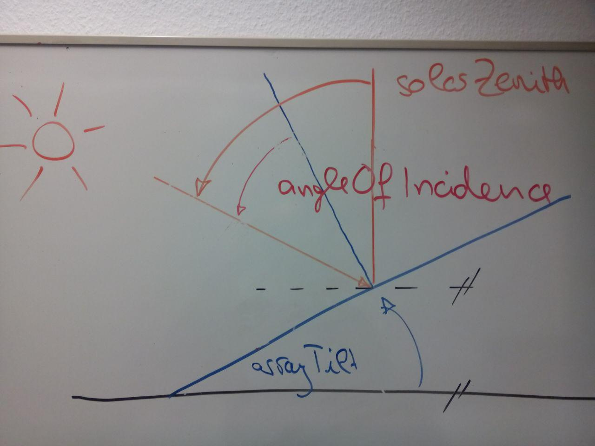
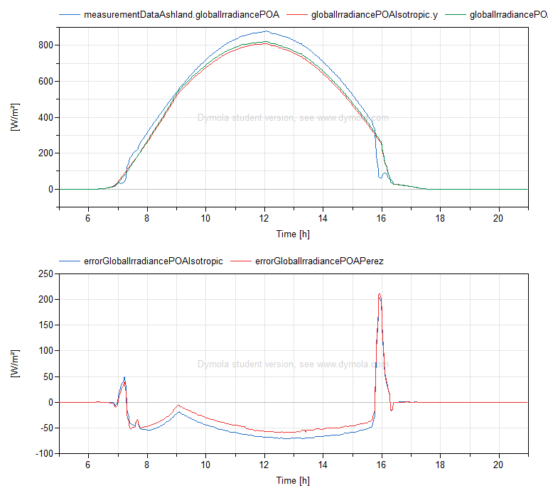
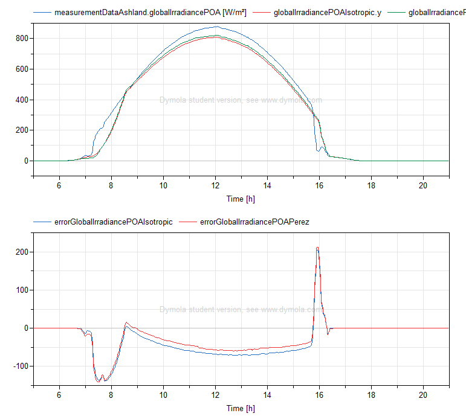
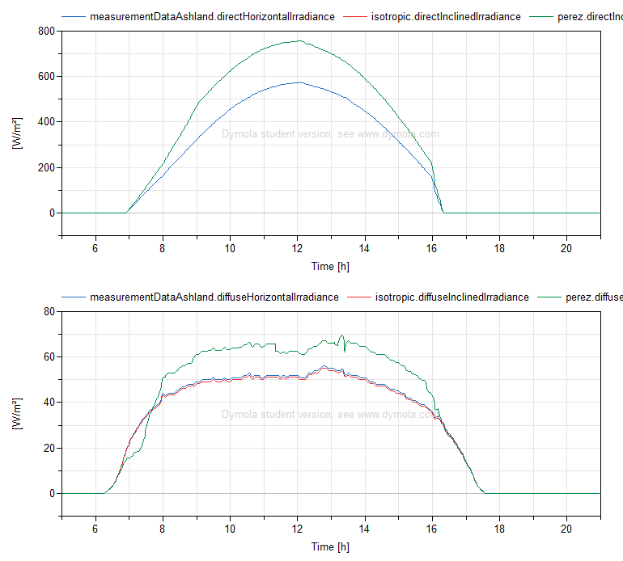
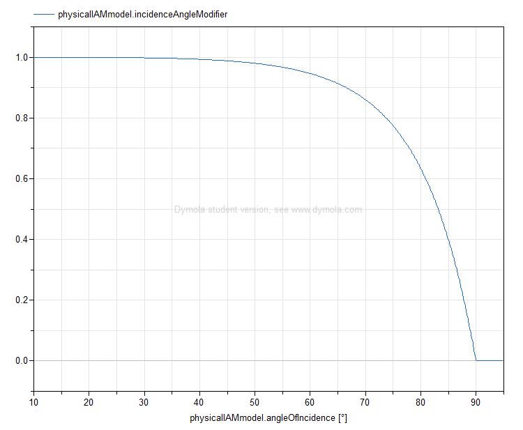

# Model-based Photovoltaic Power Forecast
One use case for the application of modelling and simulation as a service (MSaaS) in the context of energy systems to be realized by UdS AES as part of the Designetz-project is the forecast of the power generated by photovoltaic systems, also denoted solar power systems. This document briefly describes the underlying models, the modelling process as well as the validation performed using measurement data of real solar power systems.

## System Under Investigation
In order to complete the use case, at least one model that plausibly predicts the generated power based on the direct and diffuse horizontal irradiance (and possibly additional information about the environment) is needed. Consequently, this information, which is to be provided externally, is defined as the input of the model and the generated power in the form of __...__ as the output. The exact parameters to be set are defined by the specific subcomponents used, but they include the location and the orientation of the PV array. Format-wise, the model has to be provided as a Functional Mock-up Unit (FMU) in order to be compatible with the existing MSaaS-microservices.

For implementation, the modelling language Modelica was used. Therefore, the search for existing libraries focused on those implemented in Modelica, but some Python-based tools as well as TRNSYS Type 835 were also considered.

### Overview
There are three different libraries which are relevant to PV performance modelling using Modelica: [PhotoVoltaics](https://github.com/christiankral/PhotoVoltaics/), [Buildings](https://github.com/lbl-srg/modelica-buildings) and [PVSystems](https://github.com/UdSAES/pv-systems). Despite the danger of creating even more fragmentation, it was decided to create a new library for the work on this use case in order to support the learning process of the modeller and in order to enhance the (re-)usability of the aforementioned models (which can be considered 'poor' due to application-specific, data-flow-oriented interfaces).

The created library, [SolarPowerSystems](https://github.com/UdSAES/pv-systems), currently provides models for calculating the power output of a PV array of given properties at a given location and time, based on the direct and diffuse horizontal irradiance. The provided models are validated against two different datasets to ensure that the implementation is correct. As of now, there is no documentation provided, but the [website on modelling steps](https://pvpmc.sandia.gov/modeling-steps/1-weather-design-inputs/) by the [PVPerformance Modeling Collaborative](https://pvpmc.sandia.gov/) should help.

The subpackages `Components.SolarPosition` and `Components.PlantInEnvironment` contain models for calculating the irradiance on an arbitrarily-oriented plane based on the direct and diffuse horizontal irradiance. In `Components.PhotoVoltaicArray`, models for representing the DC behaviour of concentrated, symetric PV arrayes are defined, including models of losses due to reflection and temperature. The package `Components.SolarPowerPlants` combines the conversion of horizontal to POA irradiance with a PV array model, using an interface that facilitates interchanging model variants for validation and performance evaluation.

### Irradiance on an Arbitrarily-oriented Plane
The photovoltaic process inside a cell is caused by the irradiance normal to its surface. Therefore, it is necessary to transform the horizontal irradiance to the Plane of Array (POA) of the solar power plant. This transformation depends on the position of the sun relative to the plant's position and the orientation of the PV array.

* The position of the sun is calculated using the [Solar Position Algorithm](https://rredc.nrel.gov/solar/codesandalgorithms/spa/) by [Reda and Andreas (2004)][reda_andreas2004]. The source code is provided in C by NREL ([technical report][reda_andreas2003]) and called from the corresponding Modelica-blocks as an external function. As the inaccuracies introduced by this algorithm are in the range of +/-0.0003 degrees, it is not considered separately during validation.
* Angle of Incidence

    

* Accounting for an arbitrary orientation of the PV array involves two potential issues: first, applying the equation for direct irradiance blindly leads to unphysical spikes at sunrise. Second, not accepting the assumption that the diffuse radiation is uniform across the sky leads to increased implementation efforts (models fortunately provided in `Buildings.BoundaryConditions`).

    Overall, the difference between calculation and measurement are seen as "acceptably low", as shown in the figure below. It is speculated that the spike in the error towards the end of the day may be the result of a shadow on the POA sensor.

    

    1. Since the direct irradiance in the plane of array needs to be calculated from the direct _horizontal_ irradiance (direct normal irradiance not available and massively complicated to estimate), a workaround for avoiding the unphysical spikes caused by the division of the cosine of the solar zenith angle around 90°/the sine of the solar height around 0° needs to be found. Because the direct irradiance in an inclined plane is always greater than or equal to the direct horizontal irradiance, it was decided to "slide" from equality to the actual equation as shown below.

    ```Modelica
    protected
        Real threshold = Modelica.SIunits.Conversions.from_deg(15);
        Real b = directHorizontalIrradiance;
        Real c = directHorizontalIrradiance * cos(angleOfIncidence) / sin(solarHeight);
        Real f = solarHeight / threshold;

    equation
    if (solarHeight <= 0) or (abs(sin(solarHeight)) < threshold) then
        // "slide" from one equation to the other
        directInclinedIrradiance = max(0, b*(1 - f) + c*(f));
    else
        // equation c is now considered safe to use
        directInclinedIrradiance = max(0, c);
    end if;
    ```

    Theoretically, the following code should be more correct, but the implementation above was observed to better fit the measured behaviour.
    ```Modelica
    if (solarHeight <= 0) then
        directInclinedIrradiance = 0;
    elseif (abs(sin(solarHeight)) < threshold) and (solarHeight > 0) then
        // "slide" from one equation to the other
        directInclinedIrradiance = max(0, b*(1 - f) + c*(f));
    else
        // equation c is now considered safe to use
        directInclinedIrradiance = max(0, c);
    end if;
    ```

    Sliding from one equation to the other was found to perform better than just limiting the solar height using `solarHeight = Modelica.SIunits.Conversions.from_deg(max(10, (90 - solarZenith)))`, as shown below.

    

    2. Perez vs Isotropic: lower error when using the model by Perez for estimating the diffuse irradiance in an inclined plane, therefore used in following calculations.

    


### Photovoltaic Array
...
#### Electrical Model
...
#### Thermal Model
...
#### Losses
* [Incidence Angle Reflection Losses](https://pvpmc.sandia.gov/modeling-steps/1-weather-design-inputs/shading-soiling-and-reflection-losses/incident-angle-reflection-losses/): since the [ASHRAE IAM model](https://pvpmc.sandia.gov/modeling-steps/1-weather-design-inputs/shading-soiling-and-reflection-losses/incident-angle-reflection-losses/ashre-model/) is numerically problematic due to the division by the cosine of the incidence angle, the physical IAM model in the corrected version described [here](https://pvpmc.sandia.gov/modeling-steps/1-weather-design-inputs/shading-soiling-and-reflection-losses/incident-angle-reflection-losses/physical-model-of-iam/) was implemented---see figure X.

    

## Parameter Fitting
-- try 0.6 times the overall efficiency ;) --
### Process and Performance Criteria
...
### Results
...

## Validation
The solar `QAresidual / W/m2` is used as a metric of "whether the measured values of `directNormalIrradiance`, `globalHorizontalIrradiance` and `diffuseHorizontalIrradiance` comply with the equation that defines their relationship" [marion2014ea, section 3b][marion2014ea]: values closer to zero indicate increased confidence in the measurement values.

This mismatch can also be seen by comparing the measured `globalHorizontalIrradiance` to the sum of `diffuseHorizontalIrradiance` and the product of `directNormalIrradiance` and the cosine of the solar zenith angle.


__To conclude__, I assume that there is something wrong with the tracker for `directNormalIrradiance` and thus refrain from using this value if possible. Also, it won't be included in the weather forecast, which also means I shouldn't use it.
<!-- Calculating the `directInclinedIrradiance` based on  the `directNormalIrradiance` or based on the `directHorizontalIrradiance` can make a significant difference on the `globalIrradiancePOA` __because the calculation of the angle of incidence was wrong!!__, as shown in figure X.  -->

## Conclusion
...

## Caveats
* Beware that if a quantity that has a `displayUnit` is connected to a real output, this is the unit that's used! This is especially relevant for `SolarPowerSystems.Components.SolarPosition.AngleOfIncidence`
* The `angleOfIncidence` __is__ ~~_not_~~ the angle between the surface normal and the sun beam! ~~note: the German word "Einfallswinkel" actually nails it..~~

## Known Issues
Use `ModelManagement.Check.checkLibrary` and read the corresponding HTML-files to get an idea of the state of the library. In short: model behaviour validated/tested (but not in all possible configurations), documentation entirely missing, some issues with illegal model names, some non-functional models in `WIP`.

## References
* [marion2014ea]: https://dx.doi.org/10.1109/PVSC.2014.6925171
* [reda_andreas2003]: http://www.nrel.gov/docs/fy08osti/34302.pdf "Reda, I.; Andreas, A. (2003). Solar Position Algorithm for Solar Radiation Applications. 55 pp.; NREL Report No. TP-560-34302, Revised January 2008."
* [reda_andreas2004]: "Reda, I.; Andreas, A., Solar Position Algorithm for Solar Radiation Applications, Solar Energy. Vol. 76(5), 2004; pp. 577-589"
